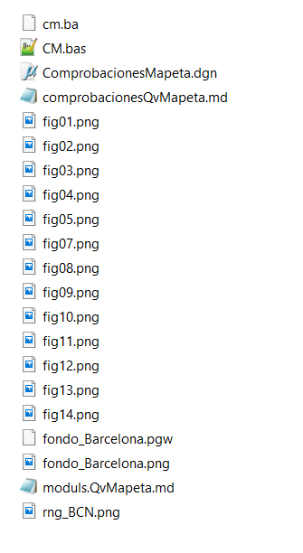

## Qué es qué...

Ficheros del directorio:

### Documentación:
*moduls.QvMapeta.md*  -->  Doc verbosa de QvMapeta
comprobacionesQvMapeta.md  --> Cómo se conecta mapeta con mundo

### Ficheros auxiliares:
*fig*.png* --> imagenes para ilustrar MD's

*fondo_Barcelona.png*  --> para referenciar como raster al dgn y ver facilitar la comprensión de los calculos
*fondo_Barcelona.pgw*  --> datos georeferenciacion del png

### Ficheros para ejecucion de pruebas
*comprobacionesMapeta.dgn*  --> 

*CM.bas*  --> escrito por version de desarrollo de QvMapeta. Son los calculos que realiza el programa, transcritos de modo que se puedan representar en un DGNPara representar las pruebas:
<!--stackedit_data:
eyJoaXN0b3J5IjpbLTE5Njc3MDY3OTgsMTgyMTMzODg1Ml19
-->