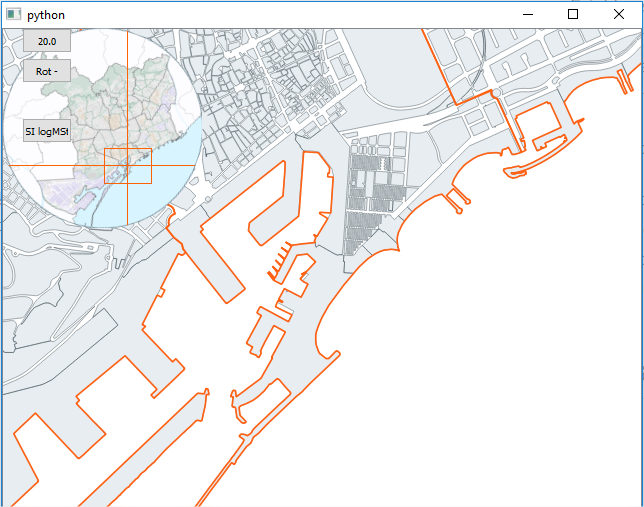
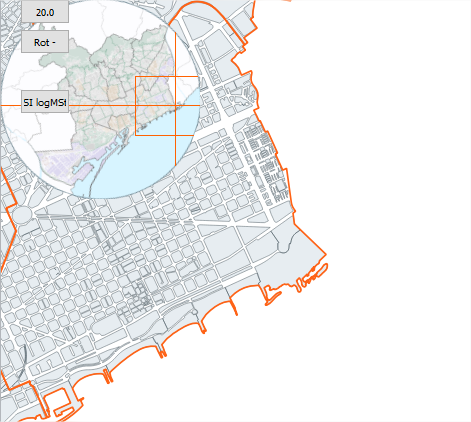
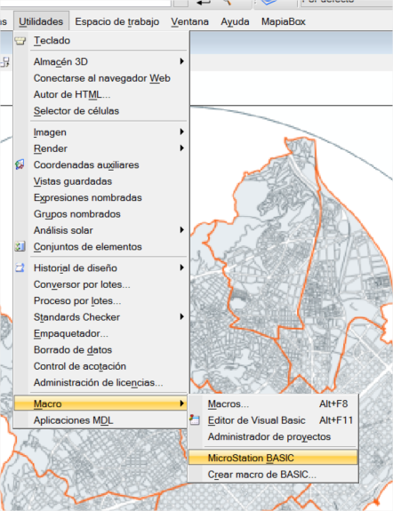
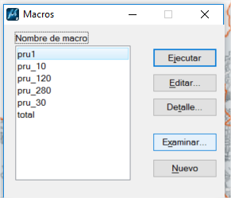
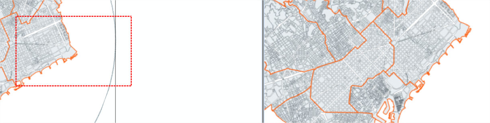
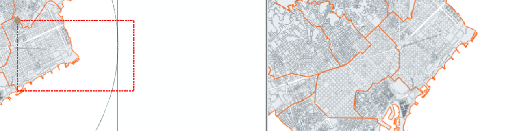
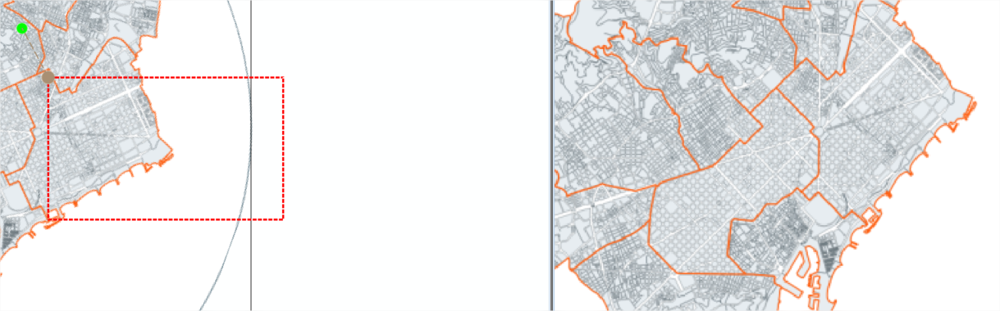
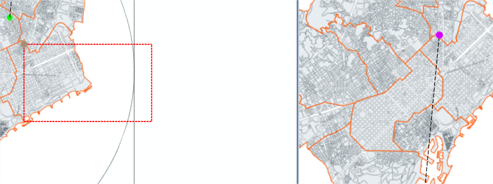

FECHA: 03/06/2020 5:39

FECHA: 02/06/2020 10:01

Situacion inicial:

Situacion final:

**He hecho una ventana**

[Comprobaciones calculos](./comprobacionesQvMapeta.md)    

Miro en carpeta:

Si he operado correctamente con el botón SI logMst, se habrá generado el fichero D:\qVista\Codi\guies\DocModuls\QvMapeta\cm.bas

Entro en microstation

Abro D:\qVista\Codi\guies\DocModuls\QvMapeta\ComprobacionesMapeta.dgn

Busco cm.bas para ejecutarlo paso a paso

Ejecuto paso a paso:

D:\qVista\Codi\guies\DocModuls\QvMapeta\cm.bas

Opcion EDITAR y Ejecuto paso a paso:

**mouseReleaseEvent**

ROJO MAPETA

Dibujamos area a representar sobre el mapeta.

Es el area &quot;deseada&quot;, que se recalculará para que se vea totalmente en el canvas, de tal manera, que tras los calculos, veremos en el mapeta que se ha recalculado este area con las proporciones del canvas y que incluye esta area señalada inicialmente.

Las coordenadas de este area deseada se almacenan en:

self.xIn, self.yIn, self.xFi, self.yFi

MARRON MAPETA

self.xIn, self.yIn,

VERDE MAPETA

Punto inicio rotado hasta 0º

El punto arriba-izquierda del area &quot;deseada&quot;(punto marron) se desrota (punto verde) respecto al centro del propio mapeta para poder calcular las coordenadas mundo. Lo hacemos gracias a que el mapeta está georeferenciado. Conocemos el tamaño del mapeta y las coordenadas mundo de sus 4 esquinas

self.xIn\_ self.yIn\_

VIOLETA MUNDO

Punto rotado a mundo. Para ver la correspondencia dibujo linea negra discontinua.

VIOLETA MUNDO

Desde punto rotado mundo construccion de caja,escalada, equivalente a la realizada en mapeta. Estará rotada.

Es el area mundo &quot;deseado&quot;

AMARILLO y AZUL MUNDO

Estos puntos sosn el rango del area mundo deseado

Se las pasamos al canvas via setExtend

CAJA AZUL MUNDO

Qgis hace sus calculos en funcion de las proporciones del canvas y nos retorna su area &quot;respuesta&quot;

CAJA VERDE MUNDO

&quot;Expansión&quot; de la caja violeta de modo que la caja azul sea su rango. Es lo que se verá en el canvas.

CAJA ROJA MAPETA

Proceso marcha atras: Recalculamos un area mapeta de &quot;respuesta&quot; que refleja lo que se ve en el canvas.

FECHA: 02/06/2020 8:43

<!--stackedit_data:
eyJoaXN0b3J5IjpbMTIyNzg0MDAwOSwxMjQ3MjI2MjcyXX0=
-->